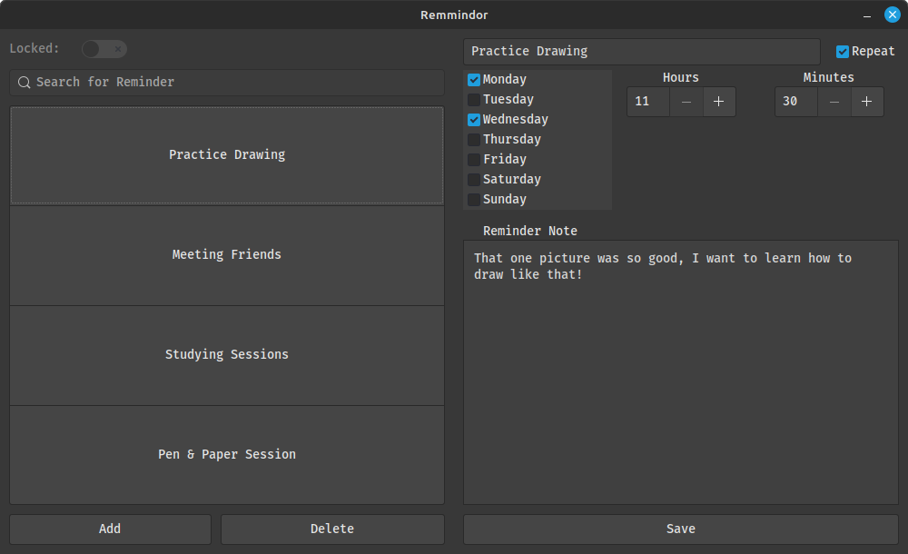

# Remmindor

Your handy reminder application written in python with GTK.

Simple yet useful.

# Preview

# Features

-   Create/Delete/Update Reminder
-   System Notifications for Reminder
-   Repeatable Reminder
-   

# Planned Features

- Repeatable by day count
- Repeatable by week count

# Installation

Requirements:

- Python 3.4+
- Gtk 3.X

# Flatpak (not available at the moment)
